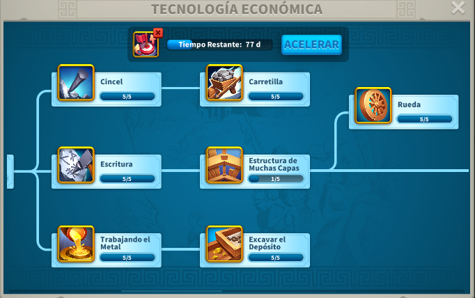
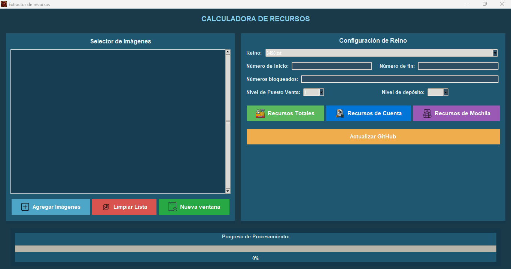

# RSS STORE APTAC - Resource Calculator

Extract game kingdom resources from screenshots automatically using OCR technology.

## 📖 Select Your Language

Choose your preferred language to read the complete user guide with installation, usage, and troubleshooting:

| 🇪🇸 Español | 🇬🇧 English | 🇵🇹 Português | 🇻🇳 Tiếng Việt | 🇮🇩 Bahasa Indonesia | 🇫🇷 Français |
|:---:|:---:|:---:|:---:|:---:|:---:|
| [Guía Completa](docs/README_es.md) | [Full Guide](docs/README_en.md) | [Guia Completa](docs/README_pt.md) | [Hướng Dẫn Đầy Đủ](docs/README_vi.md) | [Panduan Lengkap](docs/README_id.md) | [Guide Complet](docs/README_fr.md) |

---

## ✨ Features at a Glance

| Feature | Description |
|---------|-------------|
| **🎯 OCR Extraction** | Automatically reads resource values from game screenshots |
| **🌐 Multi-Language** | Interface in 6 languages: Spanish, English, Portuguese, Vietnamese, Indonesian, French |
| **📊 Batch Processing** | Process up to 100 images efficiently |
| **🔄 Auto-Updates** | Keep kingdoms database current directly from GitHub |
| **💾 Smart Export** | Save results as formatted text files with timestamps |
| **🔒 Privacy First** | 100% offline - your data never leaves your computer |

## 🚀 Quick Start

1. **Download** `RSS_STORE_APTAC_Installer.exe` from [Latest Release](https://github.com/Aptac0/Resource-Calculator/releases)
2. **Install** - Run the installer on Windows 10+
3. **Launch** - Open RSS STORE APTAC and select your language
4. **Add Images** - Select your kingdom resource screenshots
5. **Extract** - Click the resource button you need

## 📋 What You Can Do

- Extract **total resources** (Food, Wood, Stone, Gold) per account
- Extract **per-account resources** (net values)
- Extract **inventory items** (backpack/packages)
- Process **multiple accounts** with flexible numbering
- **Automatically update** kingdoms and icons from repository

## 🔧 Technical Details

- **Platform:** Windows 10+
- **Technology:** Python + PyInstaller (compiled to .exe)
- **OCR Engine:** Tesseract (included in installer)
- **No Dependencies:** Python not required - everything is bundled
- **Auto-Updates:** Downloads new versions from GitHub releases

## 📚 Documentation

For complete user guides including:
- Step-by-step installation
- How to take screenshots (PC and mobile)
- Input format specifications
- Troubleshooting tips
- System requirements

**👉 Select your language from the table above**

## 🔗 Resources

- **GitHub Repository:** https://github.com/Aptac0/Resource-Calculator
- **Latest Release:** https://github.com/Aptac0/Resource-Calculator/releases
- **Issues & Support:** https://github.com/Aptac0/Resource-Calculator/issues

## 💡 Developer Info

- **Main App:** `app.py` (tkinter GUI)
- **Build Script:** `build.bat` (PyInstaller)
- **Translation System:** `translations.py`
- **Update Helper:** `update_helper.py`
- **Kingdoms:** `kingdoms/` (configurable templates)
- **Icons:** `Iconos/` (button assets)

---

**Version:** 1.0.0 | **License:** GPL-3.0 | **Updated:** June 2026

  

### Qué hace cada botón
- `Agregar Imágenes`: abre el selector y añade imágenes a la lista.
- `Limpiar Lista`: vacía la lista de imágenes y datos temporales.
- `Nueva ventana`: abre otra instancia de la aplicación.
- `Recursos Totales`: procesa cada imagen y guarda el total de recursos detectados (Comida, Madera, Piedra, Oro) por cuenta.
- `Recursos de Cuenta`: guarda los recursos netos por cuenta (resta de objetos si aplica según OCR).
- `Recursos de Mochila`: extrae los valores "de objetos" (lo que están en mochila/paquetes).
- `Actualizar GitHub`: descarga `kingdoms/` e `Iconos/` desde el repo configurado y sobrescribe los datos locales. Si usas el `.exe`, te indicará la página de releases para descargar el instalador actualizado.

  

### Carpeta `GUARDADOS` y resultados
- Al procesar las imágenes, la app guarda automáticamente un archivo `.txt` en la carpeta a seleccion con el nombre `REINO_results_YYYYMMDD_HHMMSS.txt`.
- Cada entrada incluye: `Nickname`, `Nivel de ciudad`, `Nivel de depósito`, `Comida`, `Madera`, `Piedra`, `Oro` y un separador `---`.
- Puedes revisar estos archivos y copiarlos a tu herramienta de subida o registro.

### Ejemplo de flujo recomendado
1. Abrir juego y mostrar ventana de recursos en cada cuenta.
2. Tomar captura clara (PC screenshot o móvil -> transferir al PC).
3. En la app: `Agregar Imágenes` → seleccionar capturas en el orden de cuentas.
4. Seleccionar `Reino` correcto (o cargar plantilla); si prefieres, rellenar `Número de inicio`/`fin` y `Números bloqueados`.
5. Ajustar `Nivel de ciudad` y `Nivel de depósito` (1–25).
6. Pulsar `Recursos Totales`.
7. Revisar `GUARDADOS/` para el archivo resultante.

## Solución de problemas comunes
- Si la app no detecta 4 valores por imagen: revisa la calidad de la imagen (recorta y vuelve a intentar).
- Si ves números con sufijos `K/M/B` no reconocidos correctamente, prueba a aumentar el tamaño de la captura o usar la versión del juego en idioma esperado.
- Si `Actualizar GitHub` falla: comprueba que `GITHUB_OWNER` y `GITHUB_REPO` están bien configurados en `app.py` y que hay conexión a Internet.

## Uso del botón de actualización
La aplicación ahora tiene un botón `Actualizar GitHub`.

- Si el usuario ejecuta la aplicación desde el código fuente, el botón descarga y actualiza las carpetas `kingdoms/` e `Iconos/` desde el repositorio.
- Si el usuario ejecuta el `.exe` compilado, el botón también actualizará los datos locales y mostrará la URL de la página de releases para descargar el nuevo instalador.

## Recomendación
Cada vez que agregues un nuevo reino a `kingdoms/` en GitHub, crea un release nuevo con el ejecutable actualizado y avisa a los usuarios que presionen `Actualizar GitHub`.
