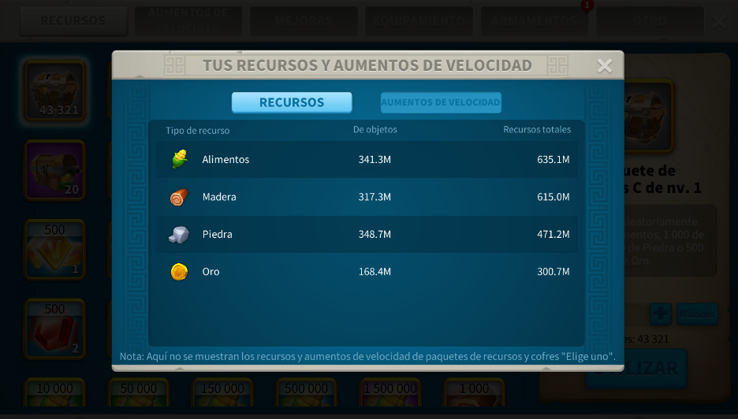
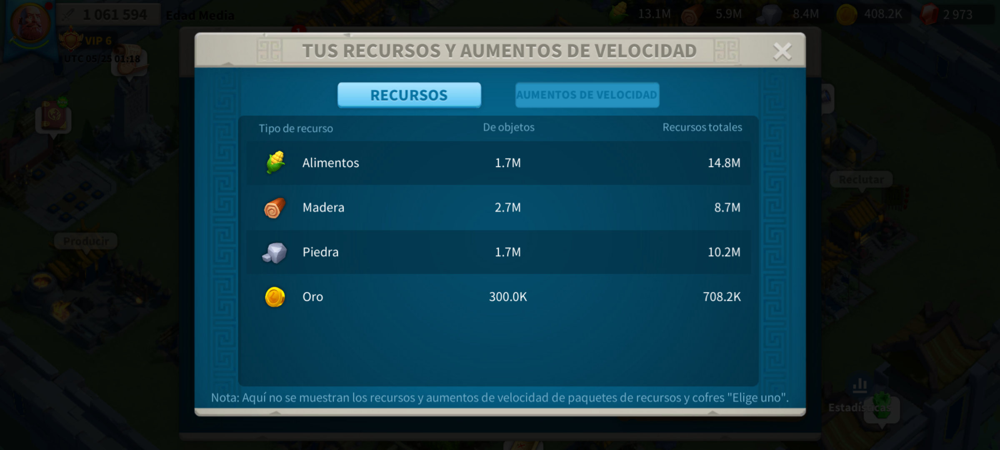
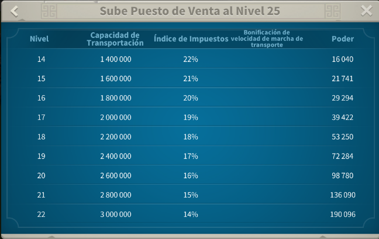
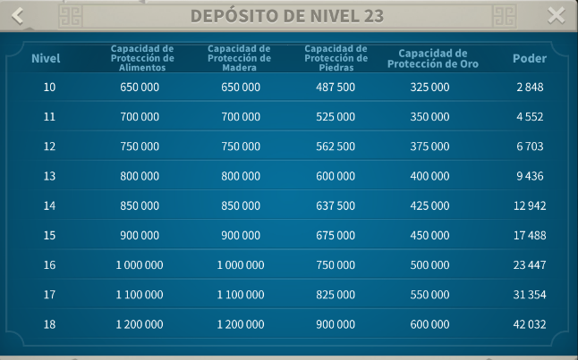

# RSS STORE APTAC - Resource Calculator

**[Español](README_es.md) | English | [Português](README_pt.md) | [Tiếng Việt](README_vi.md) | [Bahasa Indonesia](README_id.md) | [Français](README_fr.md)**

---

## 📱 What is RSS STORE APTAC?

Desktop application to automatically extract game resources from screenshots using OCR technology with intelligent account management.

## ✨ Features

- ✅ Automatic resource extraction with OCR
- 🎯 Multi-language interface (6 languages supported)
- 🔄 Automatic updates from GitHub
- 📊 Batch processing (up to 100 images)
- 💾 Export to TXT/CSV files
- 🌍 All messages respect your language selection

## 🚀 Quick Installation

1. Download `RSS_STORE_APTAC_Installer.exe` from [Releases](https://github.com/Aptac0/Resource-Calculator/releases)
2. Run the installer
3. Done! The app will auto-update when new versions are available

## 📖 User Guide

### Quick Workflow

1. **Open the application:** Run `RSS STORE APTAC.exe`
2. **Add images:** Click "Add Images" and select your screenshots
3. **Select kingdom:** Choose the appropriate kingdom from the dropdown
4. **Configure numbers:**
   - `Start number`: First account number (e.g., 1)
   - `End number`: Last account number (e.g., 30)
   - `Blocked numbers`: (optional) Numbers to skip (e.g., 3,5,7)
5. **Set levels:** Select "City Level" and "Warehouse Level" (1-25)
6. **Process:** Click the resource button you need

### How to Take Screenshots

#### From PC (Recommended)
- Open the game in windowed mode
- Take a clear screenshot of the Resources window
- Ensure numbers and labels are readable

#### From Mobile
- Transfer the image to your PC (USB, Google Drive, etc.)
- Avoid angled or blurry photos
- Ensure the image is sharp and clear

### Input Formats

#### Start and End Numbers
- Numbers only (e.g., `1` and `30`)
- Must be valid positive integers

#### Blocked Numbers (Optional)
Two available formats:
- **Range:** `1-10` (all numbers from 1 to 10)
- **List:** `1,3,5,7` (specific numbers)
- **Mixed:** `1-5,8,10-15`

**Examples:**
- `start=1`, `end=10`, `blocked=3,5` → processes: 1,2,4,6,7,8,9,10
- The app validates that you have enough images

#### Levels
- `City Level` (Market): 1-25
- `Warehouse Level` (Storage): 1-25

## 🔄 Update System

### Automatic
The app checks for new versions on startup. If found:
- You'll get a notification
- Download directly from the app
- Automatic installation

### Manual
Run `actualizar.bat` from the installation folder

## 🆘 Troubleshooting

### "Could not detect 4 values"
- Ensure the screenshot is clear and readable
- Numbers must be visible
- Try taking another clearer screenshot

### "Update error"
- Check your Internet connection
- Try again in a few minutes
- If it persists, restart the application

### Images are not processing
- Verify you selected a kingdom
- Check that numbers are valid
- Ensure you have enough images

## 📞 Support

- **GitHub:** https://github.com/Aptac0/Resource-Calculator
- **Issues:** https://github.com/Aptac0/Resource-Calculator/issues
- **Releases:** https://github.com/Aptac0/Resource-Calculator/releases

## 📝 System Requirements

- Windows 10 or later
- No need to install Python
- Internet connection (for updates)
- Tesseract OCR (included in installer)

## 🔐 Privacy

The application:
- ✅ Works completely offline
- ✅ Never sends your images to any server
- ✅ No registration or account required
- ✅ Your data stays on your computer

---

**Version:** 1.0.0  
**Last Updated:** June 2026  
**License:** GPL-3.0
